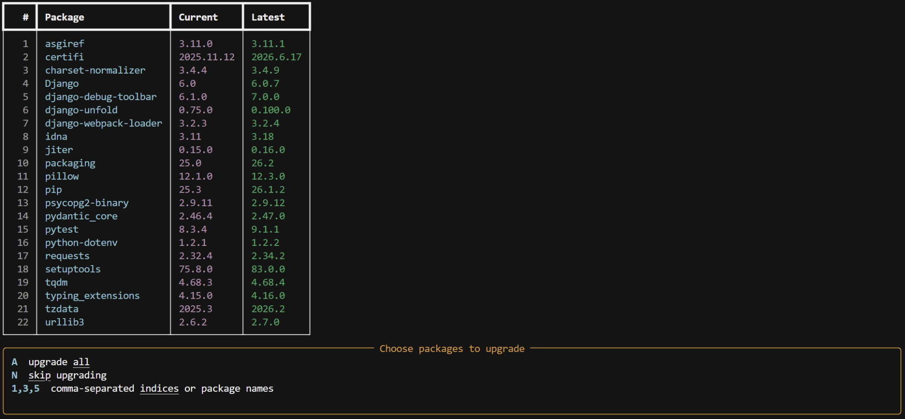
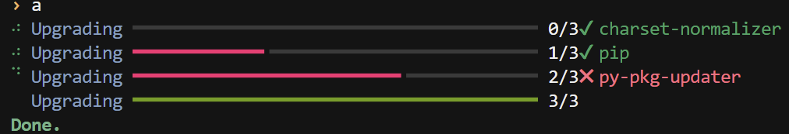

# py-pkg-updater

<div align="center">

**A clean, interactive CLI for checking and upgrading outdated Python packages in your current environment.**

[](https://pypi.org/project/py-pkg-updater/)
[](https://pypi.org/project/py-pkg-updater/)
[](LICENSE)
[](https://github.com/AlonePyWarrior/packages_updator/actions/workflows/publish-to-pypi.yml)

</div>

---

## Overview

`py-pkg-updater` helps you inspect outdated `pip` packages, compare installed versions with the latest available versions, and upgrade selected packages from an interactive terminal interface.

It is designed for developers who want a faster, cleaner workflow than repeatedly running `pip list --outdated` and manually upgrading packages one by one.

---

## Screenshots

### Outdated packages table



### Upgrade progress



---

## Features

- Detect outdated packages using `pip list --outdated`
- Display outdated packages in a clean terminal table
- Upgrade all packages or selected packages only
- Select packages by number or by package name
- Rich-powered terminal UI when `rich` is available
- Plain terminal fallback when `rich` is not installed
- Works inside any Python environment where `pip` is available

---

## Installation

Install from PyPI:

```bash
pip install py-pkg-updater
```

Upgrade to the latest version:

```bash
pip install --upgrade py-pkg-updater
```

---

## Usage

Run the command inside the Python environment you want to update:

```bash
update-packages
```

You will see a list of outdated packages and an interactive selection prompt.

### Selection options

```text
A        upgrade all packages
N        skip upgrading
1,3,5    upgrade selected packages by number
pip,rich upgrade selected packages by name
```

---

## Recommended Workflow

Use `py-pkg-updater` inside an activated virtual environment.

### Windows PowerShell

```powershell
python -m venv venv
.\venv\Scripts\Activate.ps1
pip install py-pkg-updater
update-packages
```

### Windows CMD

```cmd
python -m venv venv
venv\Scripts\activate
pip install py-pkg-updater
update-packages
```

### macOS / Linux

```bash
python3 -m venv venv
source venv/bin/activate
pip install py-pkg-updater
update-packages
```

---

## Why Use a Virtual Environment?

`py-pkg-updater` upgrades packages in the Python environment where it is executed.

For safer dependency management, use it inside a project-specific virtual environment instead of your global Python installation. This reduces the risk of breaking system-level tools or unrelated projects.

---

## Requirements

- Python 3.9 or newer
- `pip`
- `rich`

---

## Development

Clone the repository:

```bash
git clone https://github.com/AlonePyWarrior/packages_updator.git
cd packages_updator/update-python-packages
```

Create and activate a virtual environment:

```bash
python -m venv venv
```

Windows PowerShell:

```powershell
.\venv\Scripts\Activate.ps1
```

Windows CMD:

```cmd
venv\Scripts\activate
```

macOS / Linux:

```bash
source venv/bin/activate
```

Install the package in editable mode:

```bash
pip install -e .
```

Run locally:

```bash
update-packages
```

---

## Build Locally

Install build tools:

```bash
pip install --upgrade build twine
```

Build the package:

```bash
python -m build
```

Check the distribution metadata:

```bash
python -m twine check dist/*
```

This creates distribution files in the `dist/` directory.

---

## Release Process

This project can be published manually with Twine or automatically through GitHub Actions and PyPI Trusted Publishing.

### Manual release

```bash
python -m build
python -m twine check dist/*
python -m twine upload dist/*
```

### Automated release with GitHub Actions

1. Update the package version in `pyproject.toml` and `src/update_python_packages/__init__.py`.
2. Commit the version bump.
3. Push a version tag such as `v0.1.6`.
4. GitHub Actions builds and publishes the package to PyPI.

Example:

```bash
git add .
git commit -m "Release 0.1.6"
git push origin main
git tag v0.1.6
git push origin v0.1.6
```

---

## Project Structure

```text
packages_updator/
├── .github/
│   └── workflows/
│       └── publish-to-pypi.yml
├── update-python-packages/
│   ├── src/
│   │   └── update_python_packages/
│   │       ├── __init__.py
│   │       └── cli.py
│   ├── pyproject.toml
│   ├── README.md
│   └── LICENSE
└── release.py
```

---

## Safety Notes

Package upgrades can introduce breaking changes, especially in active projects.

Recommended workflow:

1. Activate your project virtual environment.
2. Run `update-packages`.
3. Upgrade selected packages.
4. Run your tests.
5. Commit dependency changes only if everything works.

Avoid running bulk upgrades in a production environment without testing.

---

## Common Commands

| Task | Command |
| --- | --- |
| Install package | `pip install py-pkg-updater` |
| Upgrade package | `pip install --upgrade py-pkg-updater` |
| Run CLI | `update-packages` |
| Build locally | `python -m build` |
| Check build | `python -m twine check dist/*` |
| Editable install | `pip install -e .` |

---

## License

This project is licensed under the MIT License.

---

## Author

Created by **Ali Esmaeilzadeh**.

